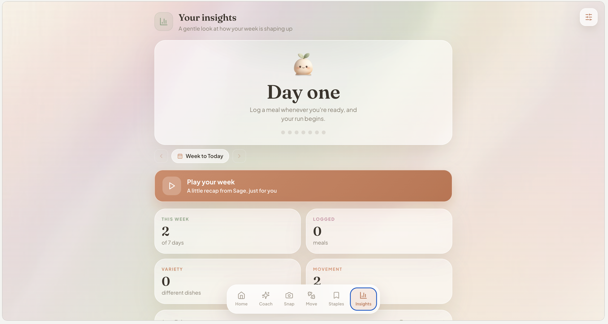

# Calorie Companion

Track your calories in a few snaps or a quick chat, with Sage, an AI coach that reads your photos, plans meals, looks things up, and logs straight from the chat.

### [Try it live](https://claude.ai/public/artifacts/edc94926-5362-4540-a43f-ee80836684c3)

Part of a weekend app series: one small, genuinely novel build per weekend. No roadmap, no scope creep, no stakeholders, just a silly idea and a Sunday night deadline.

Built as a single React file. Every smart feature is powered by Claude, called straight from inside the app.

---

## A look inside

<table>
  <tr>
    <td width="50%"><br><sub><b>Home</b> &middot; your day at a glance, with rest and workout day modes</sub></td>
    <td width="50%"><br><sub><b>Coach</b> &middot; Sage reads your photos, searches and logs from the chat</sub></td>
  </tr>
  <tr>
    <td width="50%"><br><sub><b>Snap</b> &middot; photograph a plate, or your kitchen for ideas</sub></td>
    <td width="50%"><br><sub><b>Move</b> &middot; log a workout from a screenshot or by typing it</sub></td>
  </tr>
  <tr>
    <td width="50%"><br><sub><b>Staples</b> &middot; save go-tos for one-tap logging</sub></td>
    <td width="50%"><br><sub><b>Insights</b> &middot; your streak, a seven day rhythm, and a recap from Sage</sub></td>
  </tr>
</table>

---

## Features

**Sage, an AI meal coach you actually talk to.** Brainstorm a meal in plain language and get a realistic calorie and protein breakdown. When a meal looks right, an Add button appears under it in the chat, and one tap logs it straight to your day. You can also type edits like "change my lunch to 400" and the app updates itself. Sage even has a little animated face that blinks while it thinks and grins when something gets logged.

**Just show a photo, no typing needed.** The fastest way to log is to snap your plate. Send a photo and Sage estimates the calories and protein, lists what it spotted, and drops an Add button so one tap logs it.

**Share a picture of your kitchen.** Snap your fridge or counter and Sage builds a healthy meal around what you actually have, sized to fit your day and hit your protein.

**The coach looks things up.** Tell it what you ordered, like a chicken slider from a named chain or a dish from a local restaurant, and it searches the web for real menu numbers to estimate from, rather than guessing.

**Snap a meal.** Photograph your plate and get a calorie and macro estimate, with the items it spotted listed so you can confirm or tweak before logging.

**Log a workout from a screenshot, or just type it.** Snap your fitness app, including an Apple Activity rings summary, and it reads your active burn and adds it to your day. Or type your session, like "bench press 3x10, squats 4x8, 20 min treadmill," and Sage estimates the calories and how effective it was. It even reads the date off a screenshot, so a Friday summary logs to Friday.

**Log the days you forgot.** Move the date on any logging screen and add meals or workouts to any recent day, or just tell Sage "I had a burrito on Tuesday" and it lands on the right day.

**A staples library with one tap logging.** Save your favourite meals, protein bars and protein powders once, and each gets a quick add button. Fill a new staple by snapping its label, or just type a product name and it searches the web for the calories and protein.

**Pick a goal.** Lose, maintain or gain. Targets are worked out from your details and your goal, with a gentle, capped deficit or surplus that never drops below your body's resting needs.

**Rest days and workout days that flex.** A simple toggle with two baselines. Workout days start a little higher to fuel training, and logging a session tops them up to your real burn, so harder days get more fuel without ever double counting. Macros recompute per day, and both baselines are editable in a tap.

**Gentle mode.** Switch off the exact figures and the app shows how fuelled you feel and the habits you are building instead. Nothing to hit, nothing to fail. The defaults are non restrictive throughout.

**A weekly recap.** A short, warm, animated recap of your week, written by Sage from what you have logged.

**Insights that stay encouraging.** A showing up streak, days logged, variety, and a seven day rhythm that marks the days you moved, plus your most loved meal and go to workout, all pulled from your log.

**Make it yours.** Set your own background image, per page if you like.

**It remembers.** Everything persists locally between sessions.

---

## How the AI works

The whole app is "Claude inside Claude". It calls Anthropic's Claude API (Claude Sonnet) directly from the client to power the coach, the vision estimates, the web lookups and the weekly recap.

**A structured side channel inside a normal chat.** The coach replies conversationally, but when a meal is finalised or an edit is requested it appends a hidden, delimited action block at the end of its reply:

```
<<<ACTION>>>{"type":"meal","meal":{"name":"...","calories":0,"protein":0,...}}<<<END>>>
```

The UI strips that block out of the visible message, parses it, and uses it to render the in stream Add button or to apply an edit to an existing entry. So one chat box does two very different jobs, brainstorming and structured data entry, without the user ever seeing the machinery. It quietly does a third too: when you mention a past day, the coach resolves phrases like "yesterday" or "Tuesday" into a date offset on the same block, so backfilling a forgotten meal to the right day is just another sentence.

**Vision with strict JSON and graceful fallback.** Each photo flow sends a base64 image plus a tailored prompt that asks for JSON only (a dish name, items and macros, a list of ingredients and meal ideas, or a workout). The workout reader handles both a list of individual sessions and a daily activity rings summary, pulling the active energy and the date shown so it logs to the correct day. Responses are parsed defensively, and if a read fails the app drops you into a manual entry form rather than dead ending.

**Web search where it helps.** The coach and the staples lookup use Claude's web search tool to pull real nutrition for restaurants, takeaways and branded products, and fall back to the model's own knowledge for home cooked food.

**Day aware prompting.** The coach is told whether today is a rest or workout day and how much room and which macros are left, so its suggestions match the calorie room you actually have.

---

## Under the hood

**Single file React.** One component, hooks only, no router and no global state library. View state moves through onboarding, plan review and dashboard, with the dashboard split into tabbed sections: Home, Coach, Snap, Move, Staples, Insights.

**One date navigator, everywhere.** A single date layer drives backfilling across every logging screen, bounded to a sensible recent window so forgotten days stay reachable while the day maths stays anchored to real dates.

**Honest calorie modelling.** A rest baseline from your details, nudged by your goal with a deficit or surplus that is capped and floored above your resting needs. Workout days start higher with a typical session baked in, and the day's target takes the greater of that baseline or the rest baseline plus the burn you actually log, so training is fuelled without counting the exercise twice. Macro targets recompute per day so carbs scale up on training days while protein holds steady, and protein nudges up while cutting. Inputs are range checked and results are capped, so a stray entry cannot produce a nonsense plan.

**A small, swappable persistence layer.** Data lives in React state as the source of truth, with a thin storage helper on top. The helper writes through a try and catch and falls back to in memory if storage is unavailable, so the app never breaks even when persistence does. Porting to plain localStorage for a standalone deploy is roughly a one function change.

---

## Tech stack

- React (single functional component, hooks only)
- Anthropic Claude API for the coach, vision, web lookups and recaps
- Claude web search tool for restaurant and product nutrition
- lucide-react for icons
- Client side persistence with an in memory fallback

It is one `.jsx` file, no build config required to read it.

---

## Running and deploying

The smart features call `https://api.anthropic.com/v1/messages` without an API key, which works inside Claude's artifact sandbox because the key is injected there, so the published link above is the live demo. The rest of the app (onboarding, dashboard, logging, staples, insights, persistence) is fully static and runs anywhere.

To run it standalone or on GitHub Pages, two changes are needed:

1. **Add a key safely.** Put a small backend or proxy in front of the API call that attaches your `Authorization` header, so the key never ships to the browser. The same proxy carries the web search tool.
2. **Swap the storage adapter.** Point the persistence helper at `localStorage` or your own backend instead of the sandbox store.

Drop the component into any React app (Vite or Create React App both work), install `lucide-react`, and render it.

---

## A note

This is a portfolio demo, built for fun and to explore AI native product patterns. Any calorie and macro figures it produces are rough estimates, not medical or nutritional advice. The defaults are intentionally gentle: any deficit is modest, capped and floored above your resting needs, and harder days add fuel rather than easier days cutting it.

---

## The series

This is one entry in an ongoing weekend build series, a recurring creative practice rather than a product. Each one tries to use AI in a genuinely different way and ship something small, polished and a little bit delightful by Sunday night.
